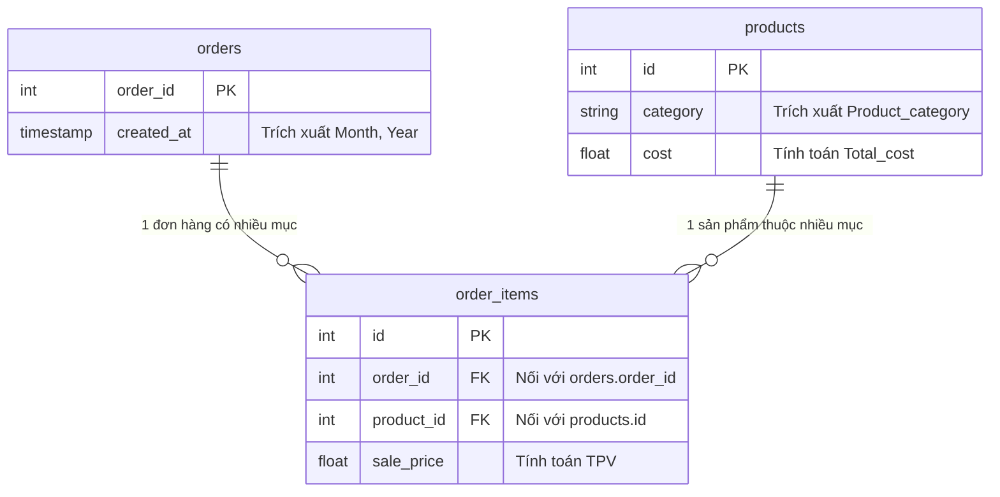

# Đồ án Phân tích Dữ liệu: TheLook eCommerce - Báo cáo Vận hành & Kinh doanh

---

## 📌 Tóm tắt Dự án (Executive Summary)
Dự án ứng dụng quy trình phân tích dữ liệu 6 bước (Ask, Prepare, Process, Analyze, Share, Act) để phân tích bộ dữ liệu thực tế của nền tảng thương mại điện tử **TheLook**. Mục tiêu của dự án là giải quyết các bài toán kinh doanh (Ad-hoc tasks) và thiết kế một hệ thống Dashboard tập trung giúp Ban giám đốc (Stakeholders) theo dõi hiệu suất, tối ưu hóa quy trình vận hành và đưa ra các quyết định dựa trên dữ liệu (Data-driven decision making).

---

## Bước 1: Đặt Vấn Đề (Ask)

### 1.1. Bối cảnh Kinh doanh (Business Context)
TheLook đang sở hữu một lượng dữ liệu lớn về khách hàng, sản phẩm và lịch sử giao dịch. Tuy nhiên, dữ liệu này đang phân mảnh, khiến việc đánh giá hiệu suất trở nên chậm trễ. Doanh nghiệp cần trả lời những câu hỏi trọng tâm:
* Tại sao doanh thu tháng qua có sự biến động?
* Yếu tố nào (độ tuổi, danh mục sản phẩm) đang tác động mạnh nhất đến quyết định mua hàng?

### 1.2. Mục tiêu Phân tích (Objectives)
Dự án được chia thành 2 cấu phần chính để giải quyết triệt để nhu cầu từ Ban quản trị:

**Phần 1: Phân tích Ad-hoc (Ad-hoc Analysis)**
Tập trung khai thác dữ liệu để trả lời 5 câu hỏi cụ thể:
1. Thống kê số lượng đơn hàng & khách hàng mỗi tháng.
2. Đánh giá giá trị đơn hàng trung bình (AOV) và sự biến động của lượng khách hàng.
3. Phân khúc khách hàng theo nhóm tuổi.
4. Xác định Top 5 sản phẩm bán chạy nhất mỗi tháng.
5. Thống kê doanh thu theo từng danh mục (Category).

**Phần 2: Xây dựng Dashboard Vận hành (Operational Dashboard)**
Đóng gói các chỉ số (Output Metrics) thành một hệ thống báo cáo trực quan, cung cấp cái nhìn toàn cảnh (Bird's-eye view) cho Ban giám đốc.

---

## Bước 2: Chuẩn Bị Dữ Liệu (Prepare)

Tận dụng kho dữ liệu trên Google BigQuery, tiến hành xác định và trích xuất các bảng dữ liệu liên quan.

### 2.1. Chuẩn bị cho Phân tích Ad-hoc
Trích xuất và liên kết các trường thông tin cần thiết:
* **Khách hàng & Đơn hàng:** `orders` (`order_id`, `user_id`, `created_at`) và `users` (`age`).
* **Doanh thu & Sản phẩm:** `order_items` (`sale_price`) và `products` (`id`, `name`, `category`).

### 2.2. Chuẩn bị cho Dashboard
Để tạo ra một "Master Dataset" phục vụ Dashboard, hệ thống dữ liệu được xây dựng dựa trên 10 chỉ số trọng yếu:

| STT | Tên trường dữ liệu | Bảng nguồn | Mô tả chi tiết |
| :-- | :----------------- | :--------- | :------------- |
| 1 | Month | `orders` | Tháng giao dịch (Định dạng yyyy-mm) |
| 2 | Year | `orders` | Năm giao dịch |
| 3 | Product_category | `products` | Danh mục sản phẩm |
| 4 | TPV (Total Processing Value)| `order_items`| Tổng doanh thu mỗi tháng |
| 5 | TPO (Total Processing Order)| `order_items`| Tổng số lượng đơn hàng |
| 6 | Revenue_growth | *Phái sinh* | % Tăng trưởng doanh thu so với tháng trước |
| 7 | Order_growth | *Phái sinh* | % Tăng trưởng đơn hàng so với tháng trước |
| 8 | Total_cost | `products` | Tổng chi phí vốn (COGS) |
| 9 | Total_profit | *Phái sinh* | Tổng lợi nhuận gộp |
| 10 | Profit_to_cost_ratio | *Phái sinh* | Biên lợi nhuận trên chi phí |

**Mô hình Dữ liệu (Data Relationship & ERD):**

---

## Bước 3: Xử Lý & Làm Sạch Dữ Liệu (Process)

Dữ liệu thô thường chứa nhiều nhiễu, do đó bước kiểm tra (Data Verification) và làm sạch (Data Cleaning) là bắt buộc.

**1. Kiểm tra tính toàn vẹn (Data Verification):**
* Bảng `orders` & `order_items`: Rà soát cột `status`. Loại trừ các đơn hàng bị hủy (`Cancelled`) hoặc bị trả lại (`Returned`) để tính doanh thu và lợi nhuận chính xác. Đảm bảo `sale_price` luôn >= 0.

* Bảng `products`: Kiểm tra cột `category` không chứa giá trị Null. Đảm bảo giá vốn `cost` >= 0.

* Bảng `users`: Kiểm tra cột độ tuổi (`age`) để loại bỏ ngoại lai (tuổi âm hoặc > 120).

**2. Làm sạch & Chuyển đổi (Data Cleaning & Transformation):**
Loại bỏ giá trị trùng lặp và chuyển đổi định dạng `created_at` về dạng chuẩn `yyyy-mm`.
* **Bảng `orders`:**

* **Bảng `order_items`:**

* **Bảng `products`:**

* **Bảng `users`:**

---

## Bước 4: Phân Tích & Trích Xuất Insight (Analyze)

Tận dụng sức mạnh của SQL (BigQuery) để biến đổi dữ liệu thành Insights.

### 4.1. Phân tích Các Chỉ Số Cốt Lõi (Ad-hoc Analysis)

**1. Tăng trưởng Đơn hàng & Khách hàng**
* **Logic SQL:** Kết hợp `COUNT(DISTINCT order_id)` và `COUNT(DISTINCT user_id)`. Dùng `FORMAT_TIMESTAMP` để gom nhóm theo tháng (2024-2026).
* **Điều kiện lọc:** Chỉ xét đơn hàng `status IN ('Complete', 'Shipped', 'Processing')`.

**2. Giá trị Đơn hàng Trung bình (AOV)**
* **Logic SQL:** AOV được tính bằng tổng doanh thu chia cho số lượng đơn hàng: `SUM(sale_price) / COUNT(DISTINCT order_id)`.
* **Điều kiện lọc:** Xóa bỏ giá trị của các mặt hàng bị trả lại để đảm bảo tính chuẩn xác cho bức tranh doanh thu.

**3. Phân khúc Khách hàng theo Độ tuổi**
* **Logic SQL:** Dùng `CASE WHEN` phân dải tuổi (<18, 18-24, 25-34, 35-44, >45). Nối bảng `users` và `orders` để đảm bảo chỉ phân nhóm **những khách hàng thực sự phát sinh giao dịch**.

**4. Xác định Top 5 Sản phẩm Bán chạy**
* **Logic SQL:** Ứng dụng Window Function `DENSE_RANK() OVER(PARTITION BY Month ORDER BY Revenue DESC)` để phân bổ hạng và chọn lọc những sản phẩm xuất sắc nhất mỗi tháng.

**5. Thống kê Doanh thu theo Danh mục (Category)**
* **Logic SQL:** `GROUP BY category` kết hợp `ORDER BY total_revenue DESC` để định vị "con gà đẻ trứng vàng" của hệ thống.

### 4.2. Khởi tạo Mô hình Dữ liệu cho Dashboard (Data Modeling)
* Ứng dụng kỹ thuật CTE (Common Table Expression) để xây dựng **Master Dataset**.
* Tính toán các chỉ số tăng trưởng (MoM) bằng Window Function `LAG() OVER(...)`.

---

## Bước 5: Trực Quan Hóa & Chia Sẻ (Share)

Sau khi chuẩn hóa nền tảng dữ liệu, quy trình kết nối (Data Pipeline) và trực quan hóa (Data Visualization) được thực hiện để đưa dữ liệu đến tay Ban lãnh đạo.

**Quy trình kết nối dữ liệu (BI Connection Pipeline):**
- **Bước 1 (Data Extraction & Preparation):** Khởi tạo Dataset `thelook_ecommerce_reports` (Data Location: US) trong project `rfm-analysis-490902` để đồng bộ vùng với dữ liệu gốc của Google.
- **Bước 2 (Data Modeling & Logic Transformation):** Viết truy vấn SQL tổng hợp các chỉ số kinh doanh cốt lõi (TPV, TPO, Total Cost, Total Profit, Cost Margin) và tính toán tỷ lệ tăng trưởng tháng theo ngành hàng (revenue_growth, order_growth) bằng Window Functions (`LAG`). Đóng gói toàn bộ logic vào View `sales_growth_view`.
- **Bước 3 (BI Connection & Semantic Layer):** Kết nối nguồn dữ liệu từ BigQuery sang [Looker Studio](https://datastudio.google.com) qua View đã tạo, đảm bảo định dạng đúng các kiểu dữ liệu (Text, Number, Date/Year).

🔗 **Truy cập Dashboard trực tiếp tại đây:** [TheLook eCommerce Dashboard - Looker Studio](https://datastudio.google.com/reporting/21c4085e-8481-435a-acd5-7314b67537bb)

---

## Bước 6: Đề Xuất Hành Động (Act)

Dựa trên các Insights đúc kết được từ biểu đồ và dữ liệu, đề xuất các hành động thực tiễn nhằm cải thiện hoạt động kinh doanh:
1. **Tối ưu hóa Marketing:** Tập trung ngân sách quảng cáo vào nhóm nhân khẩu học chiếm tỷ trọng cao nhất và danh mục sản phẩm (Category) đang có tỷ lệ sinh lời tốt nhất.
2. **Quản trị Tồn kho (Operations):** Tự động cảnh báo nguồn cung đối với Top 5 sản phẩm bán chạy mỗi tháng để tránh tình trạng "cháy hàng" (Out-of-stock).
3. **Thấu hiểu Khách hàng:** Cải thiện dịch vụ chăm sóc khách hàng đối với các đơn hàng bị `Returned` để giảm thiểu tỷ lệ hoàn trả, tối ưu hóa lợi nhuận ròng.
